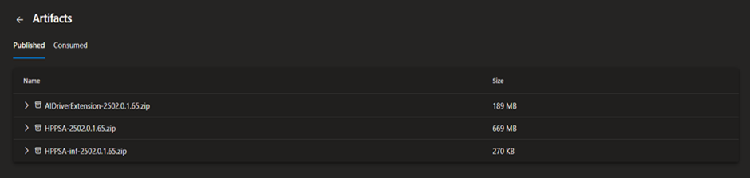

# Mobile App Installation Guide

## 1. Introduction
This guide explains how to install the mobile application on Android and iOS devices.
Follow the steps carefully to ensure a successful installation.

---

## 2. Prerequisites
Before installing the app, ensure the following:

- A smartphone with internet access
- A Google Play Store or Apple App Store account
- Sufficient storage space on the device

---

## 3. Installing the App on Android

### Steps
1. Open the **Google Play Store** on your Android device.
2. In the search bar, type the app name.
3. Select the app from the search results.
4. Tap **Install**.
5. Wait for the installation to complete.

Once installed, the app icon appears on your home screen.

---

## 4. Installing the App on iOS

### Steps
1. Open the **App Store** on your iPhone.
2. Tap the search icon.
3. Enter the app name in the search field.
4. Select the app from the list.
5. Tap **Get** and authenticate if prompted.

The app is installed automatically after download.

---

## 5. Launching the App

### Steps
1. Locate the app icon on your device.
2. Tap the icon to launch the app.
3. Follow on‑screen instructions to complete setup.

---

## 6. Installation Issues

| Issue | Solution |
|------|----------|
| App not installing | Check internet connection |
| Insufficient storage | Free up device space |
| App not found | Verify app name |

---

## 7. Uninstalling the App (Optional)

### Steps
1. Press and hold the app icon.
2. Select **Uninstall** or **Remove App**.
3. Confirm the action when prompted.

---

## 8. Revision History

| Version | Date | Description |
|--------|------|-------------|
| 1.0 | 2026‑04‑27 | Initial installation guide |

> [!NOTE]
> Below image is irelevant but kept intensionnaly. i have not added screenshots to support installation steps.
 
``
   

